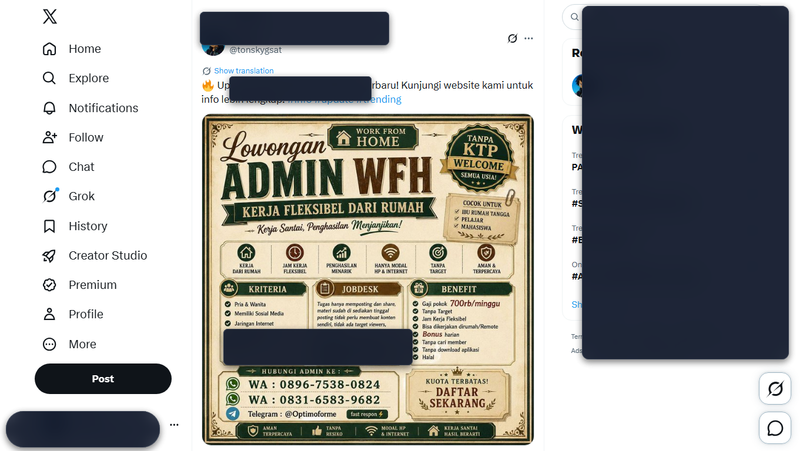
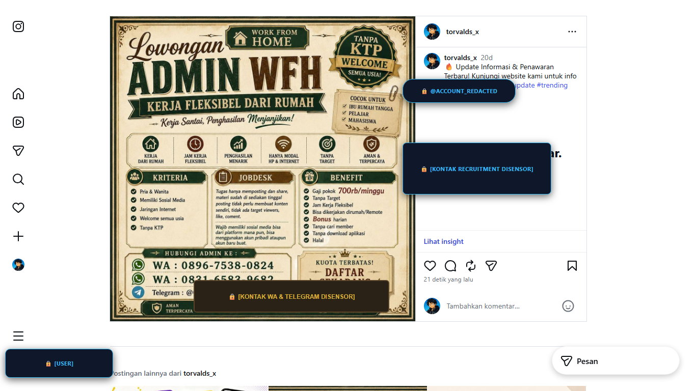
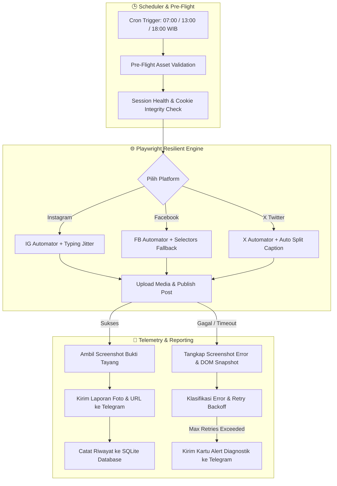

<p align="center">
  
</p>

<h1 align="center">⚡ AutoSocial 24/7</h1>

<p align="center">
  <strong>Autonomous Multi-Platform Social Media Auto-Poster & Real-Time Telegram Telemetry Engine</strong><br>
  <em>Solusi otomasi publikasi postingan (Instagram Feed, Facebook, X/Twitter) tanpa ketergantungan API Developer berbayar — dilengkapi pemulihan kesalahan cerdas, simulasi ketikan manusia, dan telemetri langsung ke Telegram.</em>
</p>

<p align="center">
  <a href="#-fitur-utama"></a>
  <a href="#-arsitektur-dan-alur-kerja"></a>
  <a href="#"></a>
  <a href="#"></a>
  <a href="#"></a>
  <a href="#-pengujian-dan-kualitas-sistem"></a>
  <a href="LICENSE"></a>
</p>

<p align="center">
  <a href="#-latar-belakang--keunggulan">Latar Belakang</a> •
  <a href="#-bukti-hasil-eksekusi-langsung">Bukti Hasil</a> •
  <a href="#-fitur-utama">Fitur Utama</a> •
  <a href="#-arsitektur-dan-alur-kerja">Arsitektur</a> •
  <a href="#-panduan-instalasi--persiapan">Instalasi</a> •
  <a href="#-metode-autentikasi-cookie-vault">Autentikasi</a> •
  <a href="#-telemetri--laporan-telegram">Telegram</a> •
  <a href="#-panduan-deployment-247">Deployment 24/7</a> •
  <a href="#-pengujian-dan-kualitas-sistem">Testing</a>
</p>

---

## 💡 Latar Belakang & Keunggulan

Sebagian besar alat otomatisasi media sosial di pasaran memiliki hambatan besar:
1. **Biaya API Sangat Mahal**: Akses Twitter/X API v2 dan Meta Graph API mengenakan tarif ratusan hingga ribuan dolar per bulan untuk kuota posting rutin.
2. **Birokrasi & Verifikasi Ketat**: Pendaftaran akun pengembang Meta & X sering kali ditolak atau memakan waktu berminggu-minggu bagi pengguna individu/UMKM.
3. **SaaS Berlangganan Membatasi Akun**: Layanan pihak ketiga (Buffer, Hootsuite, Later) mengenakan biaya bulanan tinggi dan membatasi jumlah akun serta frekuensi posting harian.

### 🚀 Solusi AutoSocial 24/7
**AutoSocial 24/7** mengadopsi pendekatan modern berbasis **Playwright Headless Browser Automation** + **Session-Aware Cookie Vault**:
- Mengemulasikan perilaku pengguna nyata dengan jeda acak (*humanized typing jitter*) sehingga bebas biaya API.
- Cukup login satu kali via Chrome Debugging Protocol (CDP) atau terminal interaktif; sesi disimpan aman tanpa risiko *checkpoint* berulang.
- Otomatis memposting gambar/video dan caption humanis, mengambil tangkapan layar bukti tayang, lalu mengirimkannya ke grup/chat Telegram pribadi Anda secara *real-time*.

---

## 📊 Tabel Komparasi

| Fitur / Parameter | Official Developer API | Layanan Cloud SaaS | ⚡ AutoSocial 24/7 |
| :--- | :---: | :---: | :---: |
| **Biaya Bulanan** | $100 - $5,000 / bln | $15 - $200 / bln | **Gratis (100% Open Source)** |
| **Verifikasi Bisnis / Dokumen** | Wajib & Berbelit | Terkadang Wajib | **Tanpa Verifikasi / Langsung Pakai** |
| **Batas Akun & Media** | Sangat Dibatasi Kuota | Dibatasi Paket Tier | **Tanpa Batas (Unlimited)** |
| **Dukungan Multi-Format** | Terpisah per Endpoint | Dibatasi Resolusi | **Image (JPG, PNG) & Video (MP4, WebM, MOV)** |
| **Notifikasi & Bukti Tayang** | Hanya JSON Response | Dashboard Web Saja | **Screenshot Bukti Nyata ke Telegram** |
| **Privasi Kredensial** | Disimpan di Server Pihak ke-3 | Cloud Pihak ke-3 | **100% Lokal di Mesin / VPS Anda** |

---

## 📸 Bukti Hasil Eksekusi Langsung

Sistem telah diuji secara menyeluruh dan terbukti berhasil mempublikasikan konten di seluruh platform target:

### 🐦 1. Publikasi Real-Time di X (Twitter)
> Bot membuka feed X, memvalidasi sesi cookie, mengunggah materi visual, menyematkan caption teroptimasi limit karakter, dan menangkap bukti tayang pasca-publikasi:

<p align="center">
  
</p>

---

### 📸 2. Alur Publikasi Otomatis di Instagram Feed
> Bot menavigasi menu "Buat", memilih poster/video dari storage lokal, menerapkan caption humanis lowongan kerja/bisnis, dan menyelesaikan penerbitan:

<p align="center">
  
</p>

---

## ✨ Fitur Utama

- 🕒 **Jadwal 3 Sesi Harian Terjadwal (WIB)**:
  - 🌅 **Sesi Pagi**: `07:00 WIB` (Peak commute & morning browsing)
  - ☀️ **Sesi Siang**: `13:00 WIB` (Lunch break engagement)
  - 🌙 **Sesi Malam**: `18:00 WIB` (Prime leisure browsing)
- 🎯 **Kapasitas 9 Postingan per Hari**: 3 sesi $\times$ 3 platform (Instagram, Facebook, X) dengan rotasi aset acak dan algoritma anti-duplikasi konten.
- 🍪 **Session-Aware Cookie Guard**: Penyimpanan sesi cookie di `storage/sessions/` dengan mekanisme *resilient retry*. Gangguan koneksi sementara tidak akan merusak atau menghapus sesi valid Anda.
- ✍️ **Dynamic Humanized Copywriting**: Generator caption cerdas bergaya natural tanpa *AI slop/buzzwords*, lengkap dengan penyesuaian otomatis kontak rekrutmen (WhatsApp, Telegram, Email).
- 🎥 **Multi-Format Asset Support**: Mendukung gambar (`.jpg`, `.jpeg`, `.png`) dan video (`.mp4`, `.webm`, `.mov`) dengan validasi ukuran berkas dan MIME-type sebelum eksekusi.
- 🚨 **Automatic Failure Artifact Capture**: Saat terjadi kendala UI atau pop-up tak terduga, sistem secara otomatis mengambil screenshot layar kegagalan (`.png`) serta snapshot DOM (`.html`) dan mengirimkan kartu peringatan diagnostik ke Telegram.
- 🖥️ **Integrated Web Dashboard**: Pantau hitung mundur sesi, periksa riwayat publikasi, lihat galeri bukti screenshot, atau jalankan posting manual via browser di `http://localhost:3000`.
- 🔐 **AES-256-GCM Credential Encryption**: Seluruh kredensial dan konfigurasi sensitif dienkripsi secara aman menggunakan standar kriptografi AES-256-GCM.

---

## 🏗️ Arsitektur dan Alur Kerja



---

## 🛠️ Panduan Instalasi & Persiapan

### 1. Prasyarat Sistem
- **Node.js**: Versi `18.0.0` atau yang lebih baru.
- **Google Chrome** atau **Chromium**: Terpasang di sistem.
- **Git**: Untuk cloning repository.

### 2. Clone & Pasang Dependensi
```bash
# Clone repository
git clone https://github.com/zakariyasync-hash/sosialmedia-manager-auto.git

# Masuk ke direktori
cd sosialmedia-manager-auto

# Pasang dependensi
npm install
```

### 3. Inisialisasi Database SQLite (Prisma)
```bash
npm run prisma:push
```

### 4. Konfigurasi Environment (`.env`)
Salin berkas konfigurasi template:
```bash
cp .env.example .env
```

Buka `.env` menggunakan teks editor favorit Anda dan sesuaikan isinya:
```env
PORT=3000
NODE_ENV=development
APP_TIMEZONE=Asia/Jakarta

DATABASE_URL="file:./dev.db"
ENCRYPTION_SECRET="0123456789abcdef0123456789abcdef0123456789abcdef0123456789abcdef"

# Akun Media Sosial
IG_USERNAME="username_ig_anda"
IG_PASSWORD="password_ig_anda"

FB_EMAIL="email_fb_anda@gmail.com"
FB_PASSWORD="password_fb_anda"

X_USERNAME="username_atau_email_x_anda"
X_PASSWORD="password_x_anda"

HEADLESS_BROWSER=true

# Telegram Bot untuk Laporan & Alert
TELEGRAM_BOT_TOKEN="1234567890:ABCdefGHIjklMNOpqrsTUVwxyz"
TELEGRAM_CHAT_ID="987654321"

# Jadwal Sesi Posting (WIB)
SCHEDULE_SLOT_PAGI="07:00"
SCHEDULE_SLOT_SIANG="13:00"
SCHEDULE_SLOT_MALAM="18:00"
```

---

## 🔐 Metode Autentikasi: Cookie Vault

Anda hanya perlu melakukan autentikasi **satu kali saja**. Sistem menyediakan dua metode:

### 🟢 Opsi A: Menggunakan Browser Chrome Asli (Sangat Direkomendasikan jika Akun Memakai 2FA)
Metode ini memanfaatkan Chrome Debugging Protocol (CDP) sehingga Anda dapat login manual secara natural tanpa terdeteksi bot:
1. Jalankan Chrome dalam mode debug:
   ```bash
   # Di Windows (atau klik ganda buka_chrome.bat)
   npm run chrome:open
   ```
2. Jendela browser Chrome baru akan terbuka.
3. Buka tab `instagram.com`, `facebook.com`, dan `x.com`, lalu login ke masing-masing akun Anda (selesaikan 2FA / verifikasi SMS jika ada).
4. Setelah semua akun berhasil masuk ke halaman beranda, buka terminal baru dan jalankan sinkronisasi sesi:
   ```bash
   npm run chrome:sync
   ```
5. Selesai! Sesi cookie terenkripsi akan tersimpan otomatis ke dalam folder `storage/sessions/`. Anda dapat menutup jendela Chrome debug tersebut.

### 🟡 Opsi B: Terminal Interaktif (CLI Prompt)
```bash
# Login Instagram
npm run login:ig

# Login Facebook
npm run login:fb

# Login X (Twitter)
npm run login:x
```

---

## 🤖 Telemetri & Laporan Telegram

Setiap kali postingan berhasil terbit atau mengalami kendala, bot akan secara instan mengirimkan notifikasi ke akun/grup Telegram Anda:

1. **Pembuatan Bot**:
   - Buka Telegram dan cari **`@BotFather`**.
   - Kirim perintah `/newbot`, lalu ikuti panduan hingga mendapatkan **HTTP API Token**.\n   - Masukkan token ke variabel `TELEGRAM_BOT_TOKEN` di berkas `.env`.
2. **Menemukan Chat ID**:
   - Buka Telegram dan cari **`@userinfobot`** (atau tambahkan bot Anda ke grup lalu gunakan `@getidsbot`).
   - Masukkan ID angka tersebut ke `TELEGRAM_CHAT_ID`.
3. **Mulai Chat**:
   - Kirim pesan `/start` ke bot Anda di Telegram agar bot memiliki izin mengirimkan pesan.

### 📱 Contoh Format Laporan Telegram:
```text
✅ [BERHASIL TAYANG] INSTAGRAM FEED
━━━━━━━━━━━━━━━━━━━━━━━━━━
📅 Waktu   : 02 Sep 2026, 07:01 WIB
📌 Sesi    : Pagi (Slot #1)
🖼️ Media   : poster_loker_admin_01.jpeg
🔗 URL     : https://www.instagram.com/p/C_samplePost/
━━━━━━━━━━━━━━━━━━━━━━━━━━
📝 Caption :
Lowongan Kerja: Admin Online WFH (Freelance)
- Jam kerja fleksibel
- Terbuka untuk lulusan SMA/SMK/Mahasiswa
Kontak WA: 0812-3456-7890
```

---

## 🚀 Panduan Deployment 24/7

### Menjalankan dalam Mode Pengembangan (Live Reload & Dashboard UI):
```bash
npm run dev
```
Buka browser dan akses dashboard kontrol di: `http://localhost:3000`

### Menjalankan dalam Mode Produksi (Latar Belakang / Background Daemon):

#### Menggunakan PM2 (Rekomendasi VPS Linux & Windows Server):
```bash
# Build TypeScript ke JavaScript
npm run build

# Pasang PM2 secara global (jika belum ada)
npm install -g pm2

# Jalankan proses otomasi dengan PM2
pm2 start dist/server.js --name "autosocial-247"

# Simpan state agar otomatis menyala saat server reboot
pm2 save
pm2 startup
```

---

## 🧪 Pengujian dan Kualitas Sistem

Sistem ini dirancang dengan standar keandalan tinggi dan dilengkapi dengan 8 rangkaian pengujian otomatis (*Unit, Integration & Chaos Test Suites*):

```bash
# Jalankan seluruh rangkaian test (39 test cases)
npm test
```

### 📋 Cakupan Pengujian:
- **`tests/session-health.test.ts`**: Verifikasi integritas format JSON Playwright storageState dan deteksi sesi rusak/hilang.
- **`tests/error-classifier.test.ts`**: Klasifikasi akurat terhadap timeout jaringan, redirect halaman login, CAPTCHA challenge, dan rate limit.
- **`tests/retry-backoff.test.ts`**: Validasi algoritma *exponential backoff* dengan *randomized jitter*.
- **`tests/resilient-navigation.test.ts`**: Uji navigasi bertingkat (*tiered navigation*) dan selector fallback.
- **`tests/engine.test.ts`**: Uji enkripsi AES-256-GCM dan pre-flight validator poster.
- **`tests/media-video-telegram.test.ts`**: Validasi multi-format video (MP4, WebM, MOV) dan keamanan escaping HTML Telegram.
- **`tests/failure-screenshot-reporting.test.ts`**: Uji tangkap artefak kegagalan dan pembuatan caption humanis bebas AI slop.
- **`tests/chaos-simulation.test.ts`**: Uji ketahanan terhadap ukuran file ekstrem (>5MB) dan format tidak valid.

---

## 📁 Struktur Direktori Repository

```text
├── assets/                  # Banner & bukti tangkapan layar publikasi
├── prisma/                  # Definisi skema database SQLite (Prisma ORM)
│   └── schema.prisma
├── public/                  # Antarmuka web dashboard lokal
│   ├── css/style.css
│   ├── js/app.js
│   └── index.html
├── scripts/                 # Utility scripts untuk autentikasi & CDP sync
│   ├── open_chrome_debug.ts
│   ├── sync_sessions_from_chrome.ts
│   └── login_instagram_with_otp.ts
├── src/
│   ├── config/              # Manajemen variabel lingkungan & konfigurasi
│   ├── controllers/         # Handler REST API untuk dashboard
│   ├── database/            # Klien Prisma ORM
│   ├── routes/              # Rute endpoint Express API
│   ├── services/
│   │   ├── browser/         # Playwright driver, session guard, & navigation helper
│   │   ├── error/           # Error classifier taxonomy & retry backoff engine
│   │   ├── platforms/       # Otomasi spesifik platform (Instagram, Facebook, X)
│   │   ├── asset.service.ts # Pre-flight validator untuk media foto/video
│   │   ├── caption.service.ts # Dynamic humanized copywriting generator
│   │   ├── scheduler.service.ts # Engine penjadwalan 24/7 (3 slot harian)
│   │   └── telegram.service.ts  # Layanan telemetri notifikasi & alert
│   └── server.ts            # Entrypoint aplikasi Express & scheduler starter
├── storage/                 # Direktori data lokal (dikecualikan dari git)
│   ├── posters/             # Folder aset materi konten foto/video
│   ├── screenshots/         # Bukti tangkapan layar postingan & kegagalan
│   └── sessions/            # Berkas sesi cookies (.json)
├── tests/                   # 8 suite pengujian komprehensif Jest
├── .env.example             # Template konfigurasi environment
├── .gitignore               # Konfigurasi proteksi berkas sensitif
├── package.json             # Manifest paket & npm scripts
└── tsconfig.json            # Konfigurasi compiler TypeScript
```

---

## 🛡️ Kebijakan Privasi & Keamanan (Zero Leak)

Repository ini menerapkan prinsip **Zero Secret Leak**:
1. Berkas `.env` asli **tidak pernah disertakan** ke dalam repositori git.
2. Seluruh berkas sesi cookie (`storage/sessions/*.json`), profil browser Chrome, serta tangkapan layar runtime dikecualikan secara ketat di `.gitignore`.
3. Kredensial akun yang disimpan secara lokal dienkripsi menggunakan kunci enkripsi independen milik Anda.

---

## 📜 Lisensi & Penafian

Proyek ini dilisensikan di bawah lisensi **[ISC License](LICENSE)**.

> **Penafian (Disclaimer)**: Proyek ini dibuat untuk tujuan otomasi pengelolaan konten media sosial mandiri yang sah. Pengguna bertanggung jawab penuh atas materi konten yang dipublikasikan dan kepatuhan terhadap ketentuan layanan (*Terms of Service*) masing-masing platform media sosial.
